+++
author = "NekoRAM7"
title = "Visual Storytelling in Ori"
date = "2022-05-09"
description = "A note of the sharing by Jeremy Gritton in GDC."
tags = [
    "GameDev",
    "Storytelling",
    "NarrativeDesign",
    "GDC"
]
categories = [
    "GDC"
]
series = ["GDC"]
aliases = ["migrate-from-jekyl"]
image = "Image.jpg"
+++

<!--more-->

## Visual Storytelling
### Developing a Consistnet Visual Vocabulary for a Sequence
#### Direction indicates Theme
1. **Left** = `the past`, `security`, or `what is known`
2. **Right** = `the future`, `uncentainty`, or `the unknown`
##### Example

>In the beginng, Ori is beckoned by Gumo to the cave on the left, which is an familiar from the first game, as if returning to the past.

>Then ori exits the cave and a big seasonal montage begins, where we have sweeping camera with a strong rightward momentum.

>The narration tells player that the answer to help Ku lay in the past, so Ori returns back to the left.

>Once retrieved the item, Ori backs right to Ku. Then we begin the journey into will of the wisps.

#### Seasonal Montage

Create a balance between what is nostalgic and what is new.
The montage takes player back to the familiar scenes in blind forest.

### Getting Value from 15 Seconds
1. Each action adds new information
2. Develops character bonds
3. Tells a small, encapsulated story
4. Works as a step in a larger story

### Flight Sequence - Blend of 3 Ideas
1. A daytime transition(from dawn to darkness): More visual variety
2. The mastery of flight
3. A goodbye letter to Nibel
The combination creates a unique sequence
#### Daytime transition
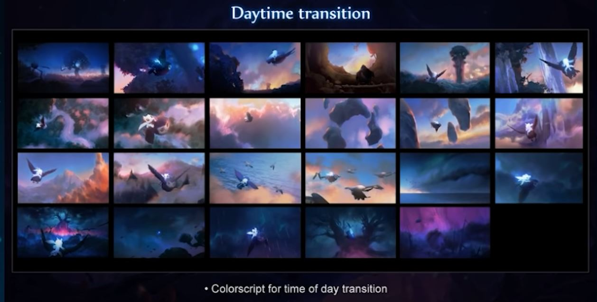
The daytime transform from dawn to darkness, which provide more visual and emotional variety.
#### Mastery of flight
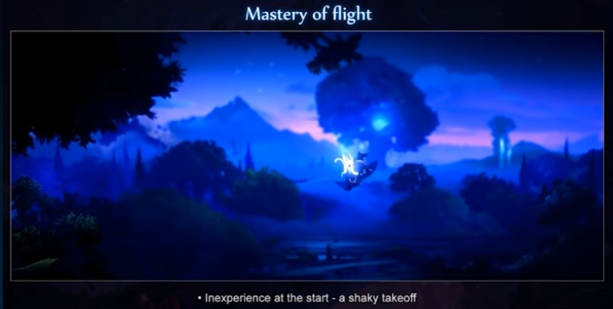
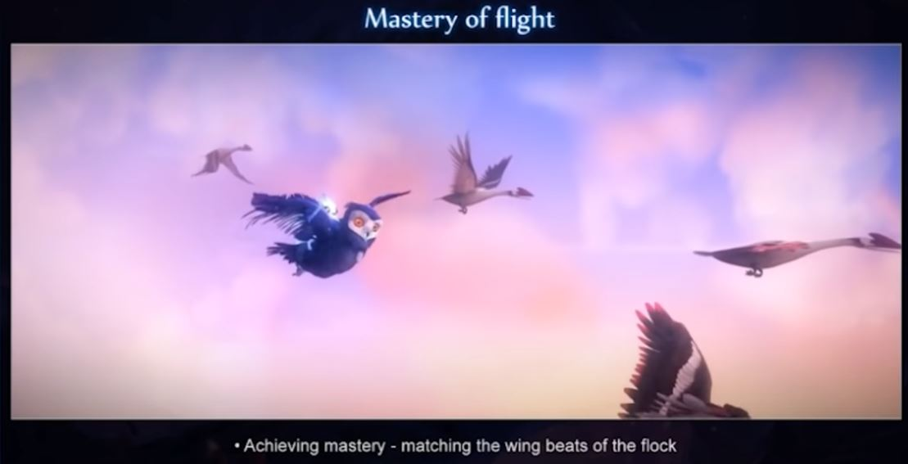
#### Saying Goodbye to Nibel
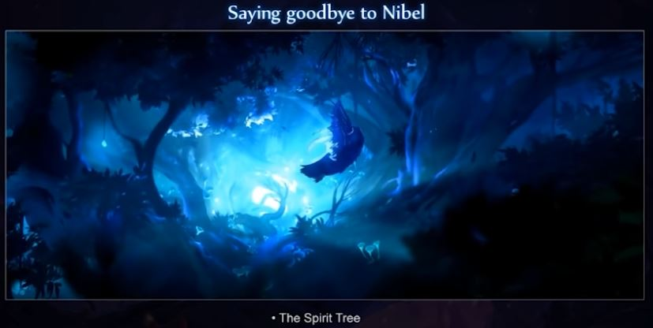
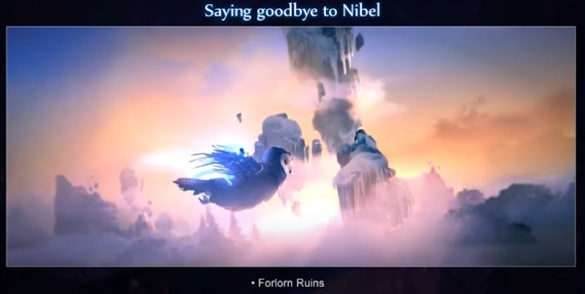
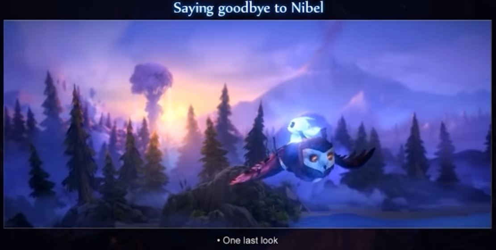

### Story Sketch
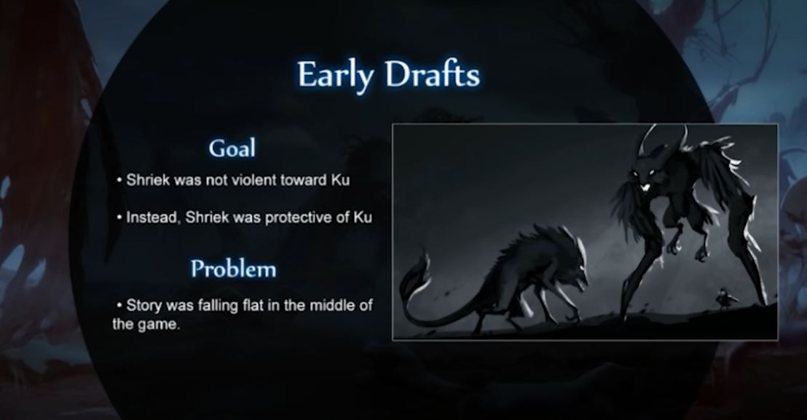
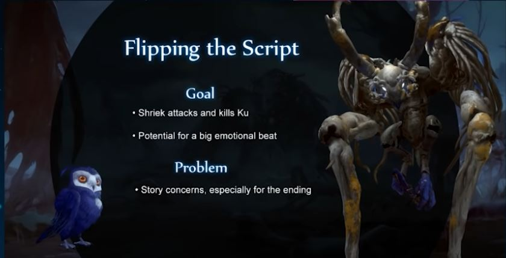
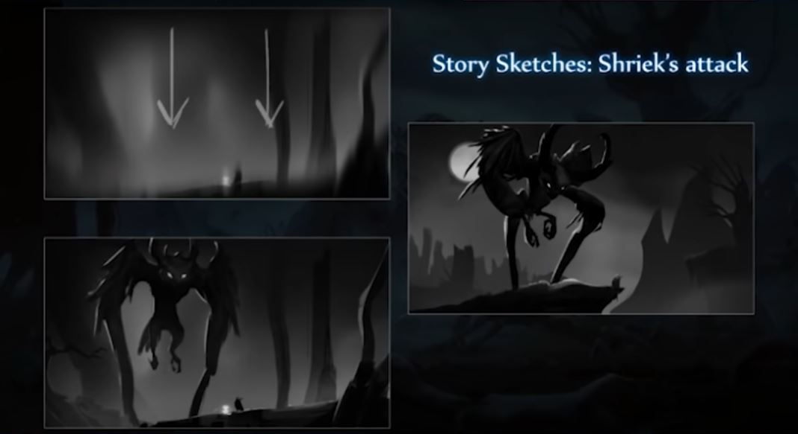
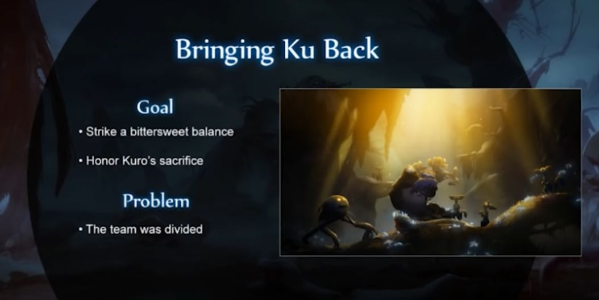
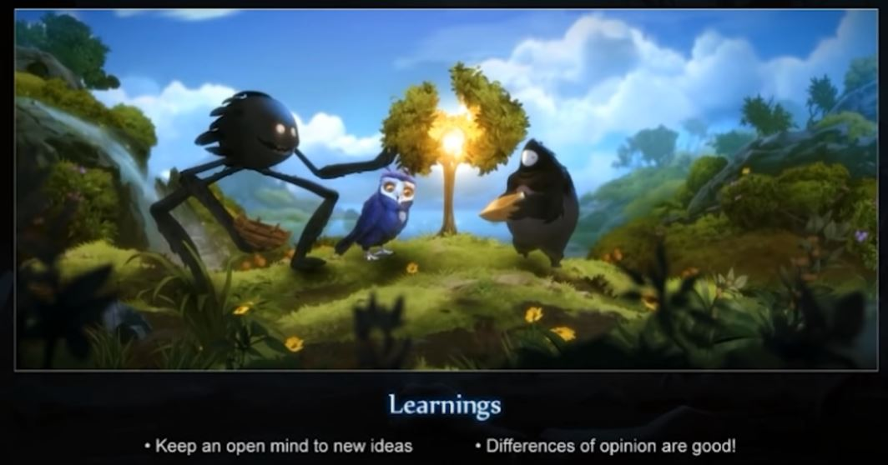

### Development of the Willow Ceremony
1. A big moment at the end
2. A reversal of its life cycle
3. Its own kind of Spirit Tree
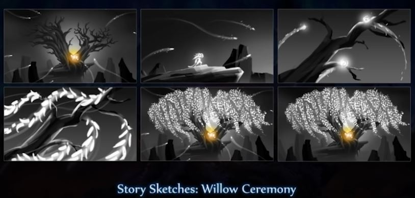
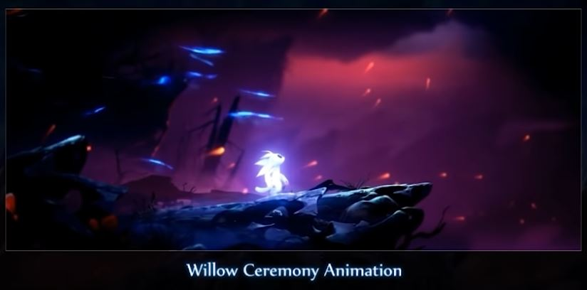

### The Game as Allegory
**Blind Forest:** The child-parent relationship  
**Will of the Wisps:** The transition from child to adult 

### A Full Circle
The Story is circular.
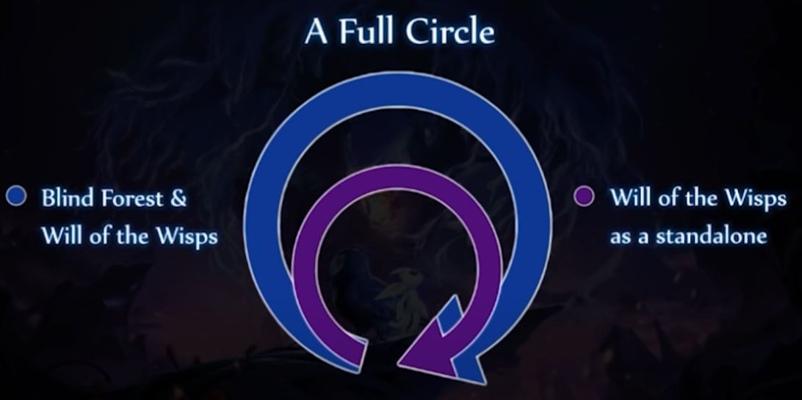
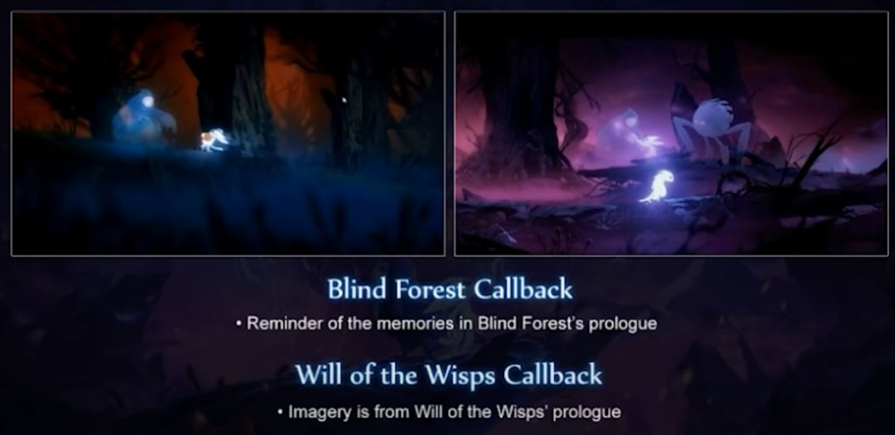
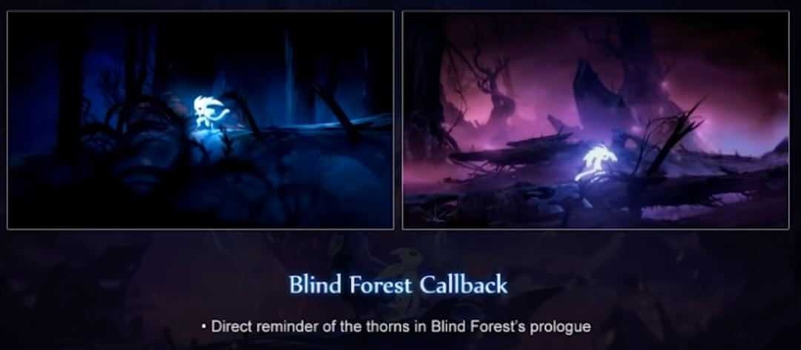
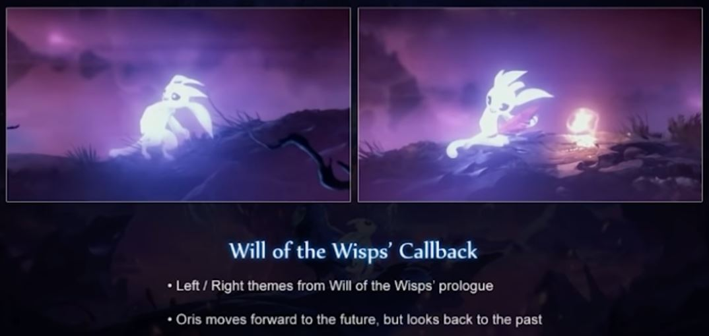
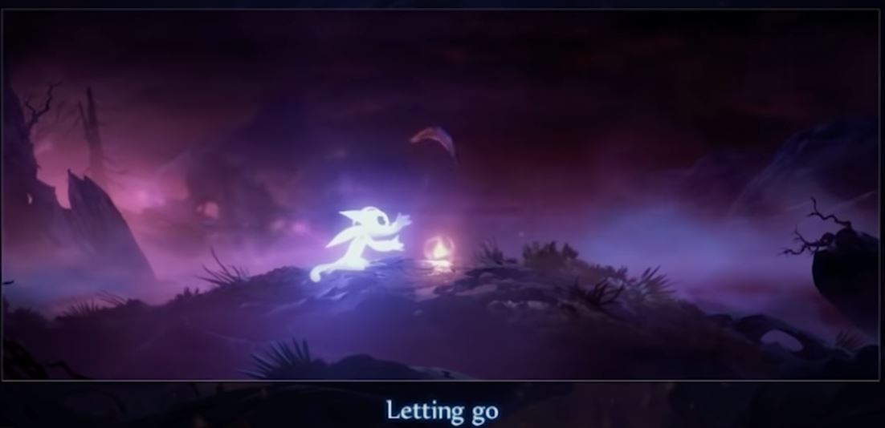
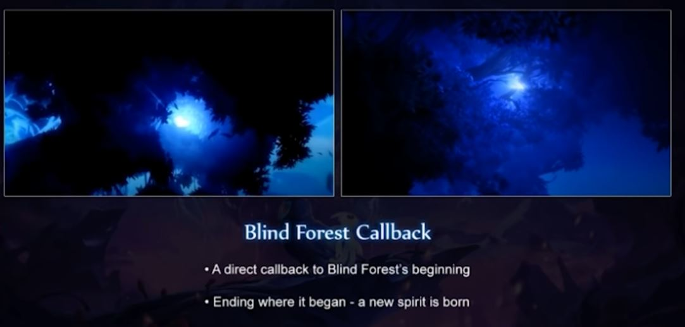
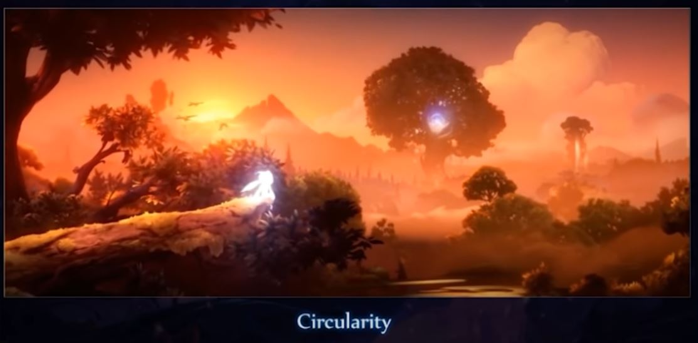

