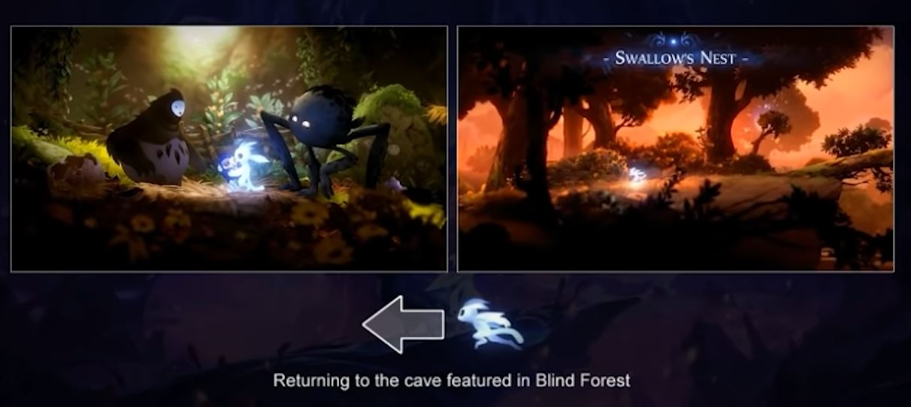
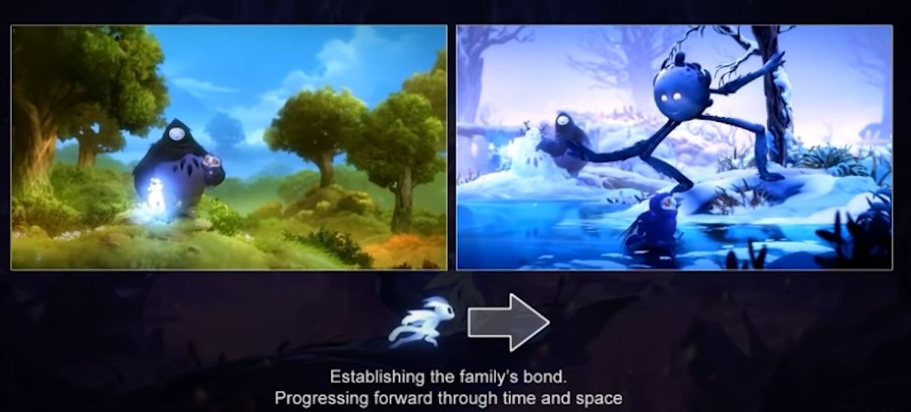
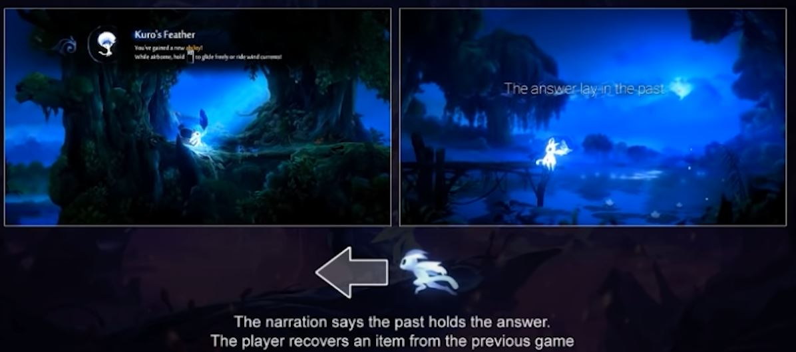
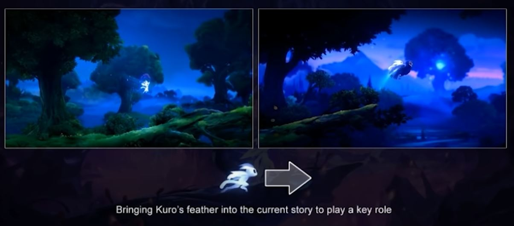
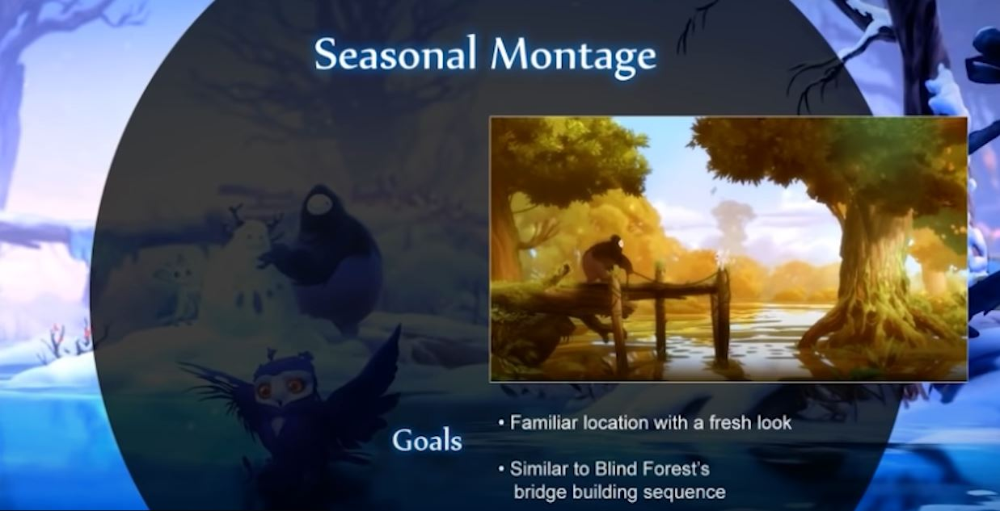

+++
author = "NekoRAM7"
title = "Narrative Design and Visual Storytelling in Ori"
date = "2022-05-09"
description = "A note of the presentation by Jeremy Gritton and Chris McEntee in GDC."
tags = [
    "GameDev",
    "Storytelling",
    "NarrativeDesign",
    "GDC"
]
categories = [
    "GDC"
]
series = ["GDC"]
aliases = ["migrate-from-jekyl"]
image = "Image.jpg"
+++

This article offers an insight into the framework of UE, by analyizng the steps to take when an UE game is launched.
<!--more-->

# Visual Storytelling

## Developing a Consistnet Visual Vocabulary for a Sequence
### Direction indicates Theme
1. **Left** = `the past`, `security`, or `what is known`
2. **Right** = `the future`, `uncentainty`, or `the unknown`
##### Example

>In the beginng, Ori is beckoned by Gumo to the cave on the left, which is an familiar from the first game, as if returning to the past.

>Then ori exits the cave and a big seasonal montage begins, where we have sweeping camera with a strong rightward momentum.

>The narration tells player that the answer to help Ku lay in the past, so Ori returns back to the left.

>Once retrieved the item, Ori backs right to Ku. Then we begin the journey into will of the wisps.

### Seasonal Montage

Create a balance between what is nostalgic and what is new.
The montage takes player back to the familiar scenes in blind forest.

# Narrative Design

