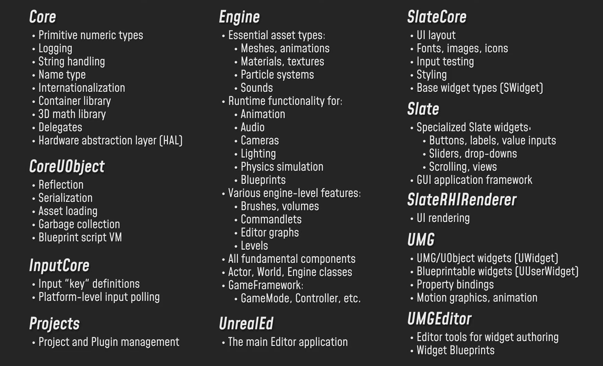
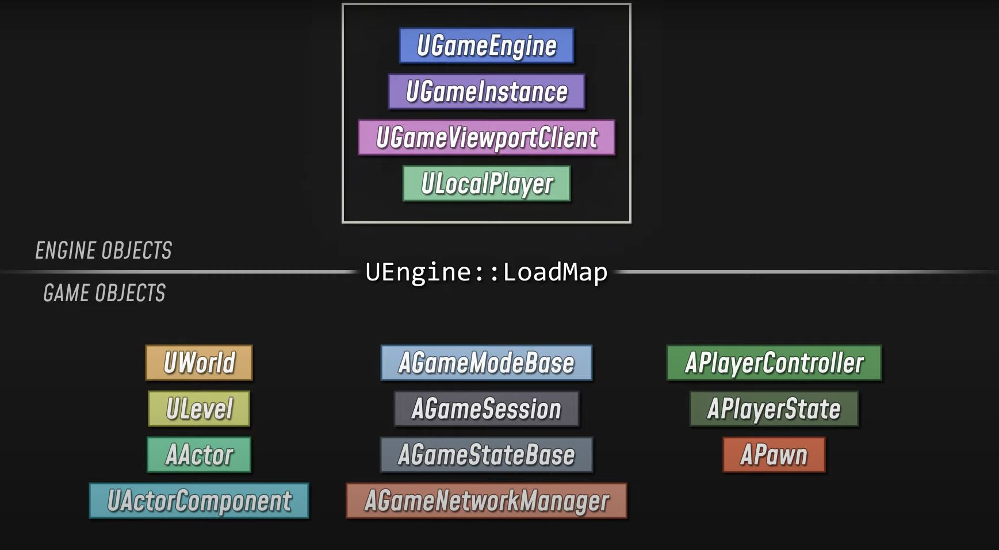

+++
author = "NekoRAM7"
title = "UE Framework-From int main() to BeginPlay()"
date = "2022-05-08"
description = "An article to show the procedure to start a game powered by Unreal Engine."
tags = [
    "GameDev",
    "UnrealEngine"
]
categories = [
    "UnrealEngine"
]
series = ["Unreal"]
aliases = ["migrate-from-jekyl"]
image = "Image.jpg"
+++

This article offers an insight into the framework of UE, by analyizng the steps to take when an UE game is launched.
<!--more-->


## Game Loop
```cpp
int main()
{
    init();
    while(!g_exit_requested)
    {
        poll_input();
        update();
        render();
    }
    shutdown();
}
```

## Launch
The game launches via the launch file of the specific platform.
```cpp
// Simplified launch.cpp
#include "LaunchEngineLoop.h"

FEngineLoop GEngineLoop;
bool GIsRequestingExit = false;

int32 GuardedMain(const TCHAR* CmdLine)
{
    // Run early Initialization, load engine modules
    int32 ErrorLevel = GEngineLoop.PreInit(CmdLine); // Most modules are loaded in PreInit
    if(ErrorLevel != 0 || GisRequestingExit)
    {
        return ErrorLevel;
    }

    // Create and initialize a UEngine, run late initialization, start the game
    ErrorLevel = GEngineLoop.Init();

    // Every frame: kick off rendering, tick the engine, update RHI
    while(!GIsRequestingExit)
    {
        GEngineLoop.Tick();
    }

    // Run cleanup and exit when requested
    GEngineLoop.Exit();
    return ErrorLevel;
}
```
## `GEngineLoop.PreInit()
The source code is divided into modules.  
A module system helps ensure that dependencies between different parts of the source code are manageable and that only the required modules are loaded.


In the `PreInit` of the game loop, some basic modules are loaded in preparation for subsequent initialization, such as defining primitive types.
### Load Sequence：
#### 1. LoadCoreModules
CoreUObject
#### 2. LoadPreInitModules
Engine
Renderer
Rendering APIs
AnimGraphRuntime
SlateRHIRenderer
Landscape
RenderCore
#### 3. Project & Plugin (Early Loading)
#### 4. LoadStartupCoreModules
   Core
   Networking
   XAudio2
   Messaging
   Slate
   UMG
   Overlay
   ClothingSystemRuntimeNv
   PacketHandler
   ...
#### 5. Project & Plugin (Default Point)
GamePlay Codes
### Module Loading Process

1. First, the engine registers all the `UObject` classes defined in the module, which are known by the reflection system, and constructs a `Class Default Object` (CDO) for each Class. The CDO is a record of the default state of the class and serves as a prototype for subsequent inheritance. The engine circulates the CDO, runs its constructor, and passes the parent class's CDO as a template. Therefore there should be no Gameplay code in the constructor.
2. Second, the engine calls module's `StartupModule` function, which corresponds to `ShutdownModule` to perform the required initialization during module's lifetime. 

To sum up, `GEngineLoop.PreInit()` loads the basic system, engine blocks, gameplay code, and plug-in modules, all of which are required for subsequent initialization.

## GEngineLoop.Init()

### Create Instance of UGameEngine
```cpp
GEngine = NewObject<UEngine>(GetTransientPackage(), EngineClass);
``` 
 The engine firstly checks the configuration to decide use which class, then creates the instance `GEngine` of the class as global `UGameEngine` instance.  
 `GEngine` is declared in `Engine/Engine.h`. 
### Initialize GEngine

```cpp
// Initialize the engine: this creates UGameInstance and UGameViewPortClient
GEngine->ParseCommandline();
GEngine->Init(this);
FCoreDelegates::OnPostEngineInit.Broadcas();
```
When `GEngine` is initialized, a global delegate is fired to indicate that the Engine is now initialized.  

### Initialize any late-loaded modules
```cpp
// Initialize any late-loaded modules
IProjectManager::Get().LoadModulesForProject(EloadingPhase::PostEngineInit);
IPluginManager::Get().LoadMoudlesForEnabledPlugings(EloadingPhase::PostEngineInit);
```
The engine loads any project or plugin modules that have been configured for late loading.  

Now, the engine is started and initialization is complete.

### Load Map
`UEngine` class enables user to load into a map and start playing.  
The Engine is able to browse to an URL, which can represent either a server address to connect to as a client, or the name of a map to load up locally.

## Engine Initialization
```cpp
// In GameEngine.cpp； UGameEngine::Init()

// Load and apply user game settings
GetGameUserSettings()->LoadSettings();
GetGameUserSettings()->ApplyNonResolutionSettings();

// Create UGameInstance, UGameViewportClient and ULocalPlayer 

// Create an UGameInstance using the class specified by project config
// After UE4.4, UGameInstance was spun off from the UGameEngine class to handle some of the more project-specific functionality.
FSoftClassPath GameInstanceClassName = GetDefault<UGameMapsSettings>()->GameInstanceClass;
UClass* GameInstanceClass = LoadObject<UClass>(nullptr, *GameInstanceClassName.ToString());
GameInstance = NewObject<UGameInstance>(this, GameInstanceClass);

// Create FWorldContext and dummy UWorld; initialize subsystems
GameInstance->InitializeStandalone();

// Create an UGameViewportClient and initialize it
// UGameViewportClient is essentially a high-level interface for the rendering, audio, and input systems, which is between UEngine and ULocalPlayer.
UGameViewportCLient* ViewportClient = NewObject<UGameViewportClient>(this, GameViewportClientClass);
ViewportClient->Init(*GameInstance->GetWorldContext(), GameInstance);
GameViewport = ViewportClient;
GameInstance->GetWorldContext()->GameViewport = ViewportClient;
CreateGameViewport(ViewportClient);

// Create a ULocalPlayer and associate it with the view client
// ULocalPlayer represents the user who is sitting in front of the screen
FString Error;
ViewportClient->SetupInitalLocalPlayer(Error);
UGameViewportClient::OnviewportCreated().Broadcast();

```
Now, we have an `UGameEngine`, an `UGameInstance`, an `UGameViewportClient` and an `ULocalPlayer`. The game is ready to start.

